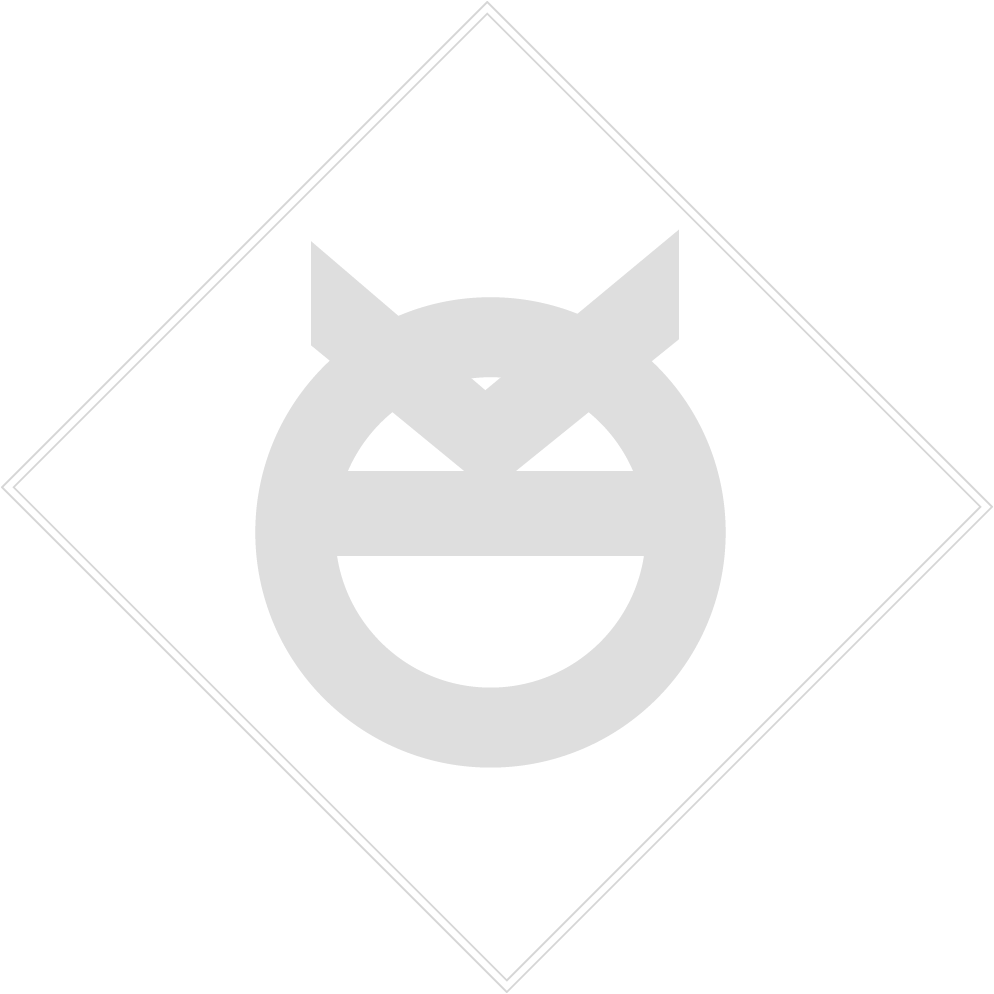

 

OWUSU KUSI   UX/UI DESIGNER KUZO.KUSI.OWUSU@GMAIL.COM  +1 (347)-320-5484  [OWUSUKUSI.COM](https://www.owusukusi.com "My Portfolio")

| joe         | hi          |
| ----------- | ----------- |
| yay         | aye         |

**SOFTWARE**&nbsp; &nbsp; &nbsp; &nbsp; &nbsp; &nbsp; &nbsp; &nbsp; &nbsp; &nbsp; **UX/UI SKILLS** 
Adobe Xd&nbsp; &nbsp; &nbsp; &nbsp; &nbsp; &nbsp; &nbsp; &nbsp; &nbsp; &nbsp; &nbsp; User Research   
Adobe Illustrator&nbsp; &nbsp; &nbsp; &nbsp; &nbsp; &nbsp;  Ideation  
Adobe Indesign&nbsp; &nbsp; &nbsp; &nbsp; &nbsp; &nbsp; &nbsp; Evaluation 
Adobe Animate&nbsp; &nbsp; &nbsp; &nbsp; &nbsp; &nbsp; &nbsp; Wireframes 
Adobe Photoshop&nbsp; &nbsp; &nbsp; &nbsp; &nbsp; Prototyping 
Adobe After-Effects&nbsp; &nbsp; &nbsp; &nbsp; Motion Graphics 
Adobe Premiere&nbsp; &nbsp; &nbsp; &nbsp; &nbsp; &nbsp; &nbsp; HTML 
Adobe Dreamweaver&nbsp; &nbsp; &nbsp; CSS 
Sketch app&nbsp; &nbsp; &nbsp; &nbsp; &nbsp; &nbsp; &nbsp; &nbsp; &nbsp; &nbsp; &nbsp; Visual Design 
Invision &nbsp; &nbsp; &nbsp; &nbsp; &nbsp; &nbsp; &nbsp; &nbsp; &nbsp; &nbsp; &nbsp; &nbsp; &nbsp; &nbsp;Accessibility Design 
Maya lt&nbsp; &nbsp; &nbsp; &nbsp; &nbsp; &nbsp; &nbsp; &nbsp; &nbsp; &nbsp; &nbsp; &nbsp; &nbsp; &nbsp; Usuability Design 
Sketch Pro&nbsp; &nbsp; &nbsp; &nbsp; &nbsp; &nbsp; &nbsp; &nbsp; &nbsp; &nbsp; &nbsp; &nbsp;Video Editing 
Autocad &nbsp; &nbsp; &nbsp; &nbsp; &nbsp; &nbsp; &nbsp; &nbsp; &nbsp; &nbsp; &nbsp; &nbsp; &nbsp; Illustration 
Revit &nbsp; &nbsp; &nbsp; &nbsp; &nbsp; &nbsp; &nbsp; &nbsp; &nbsp; &nbsp; &nbsp; &nbsp; &nbsp; &nbsp; &nbsp; &nbsp;3D Modeling 
 

**INTERPERSONAL SKILLS**  
Problem Solving  
Collaborative Problem Solving  
Group Work  
Communication  
Teamwork  
Cultural Awareness  
Creativity 
Critical and Structured thinking 
Responsibility 
Empathy 
Time Management  

College
 (Currently) New York College of Tecnology expected   graduation: June 2020 in bachelors of fine arts

  
 | Syntax | Description | Test Text     |
| :---       |    :----:   |          ---: |
| OWUSU KUSI   UX/UI DESIGNER KUZO.KUSI.OWUSU@GMAIL.COM  +1 (347)-320-5484  [OWUSUKUSI.COM](https://www.owusukusi.com "My Portfolio")      |      | Here's this   |
| Paragraph   | Text        | And more      |

| OWUSU KUSI   UX/UI DESIGNER KUZO.KUSI.OWUSU@GMAIL.COM  +1 (347)-320-5484  [OWUSUKUSI.COM](https://www.owusukusi.com "My Portfolio")   &nbsp; &nbsp; &nbsp; &nbsp; &nbsp; &nbsp; &nbsp; &nbsp; &nbsp; &nbsp; &nbsp;  &nbsp; &nbsp; &nbsp; &nbsp; &nbsp; &nbsp; &nbsp; &nbsp; &nbsp; &nbsp; &nbsp;  &nbsp; &nbsp; &nbsp; &nbsp; &nbsp; &nbsp; &nbsp; &nbsp; &nbsp; &nbsp; &nbsp;  &nbsp; &nbsp; &nbsp; &nbsp; &nbsp; &nbsp; &nbsp; &nbsp; &nbsp; &nbsp; &nbsp;  &nbsp; &nbsp; &nbsp; &nbsp; &nbsp; &nbsp; &nbsp; &nbsp; &nbsp; &nbsp; &nbsp;|   &nbsp; &nbsp; &nbsp; &nbsp; &nbsp; &nbsp; &nbsp; &nbsp; &nbsp; &nbsp; &nbsp;  &nbsp; &nbsp; &nbsp; &nbsp; &nbsp; &nbsp; &nbsp; &nbsp; &nbsp; &nbsp; &nbsp;  &nbsp; &nbsp; &nbsp; &nbsp; &nbsp; &nbsp; &nbsp; &nbsp; &nbsp; &nbsp; &nbsp;  &nbsp; &nbsp; &nbsp; &nbsp; &nbsp; &nbsp; &nbsp; &nbsp; &nbsp; &nbsp; &nbsp;  &nbsp; &nbsp; &nbsp; &nbsp; &nbsp; &nbsp; &nbsp; &nbsp; &nbsp; &nbsp; &nbsp;  &nbsp; &nbsp; &nbsp; &nbsp; &nbsp; &nbsp; &nbsp; &nbsp; &nbsp; &nbsp; &nbsp;  &nbsp; &nbsp; &nbsp; &nbsp; &nbsp; &nbsp; &nbsp; &nbsp; &nbsp; &nbsp; &nbsp; &nbsp; |
|:---	|:---	|
|**SOFTWARE**&nbsp; &nbsp; &nbsp; &nbsp; &nbsp; &nbsp; &nbsp; &nbsp; &nbsp; &nbsp; **UX/UI SKILLS**   	|  	|
|   	|   	|
|   	|   	|
